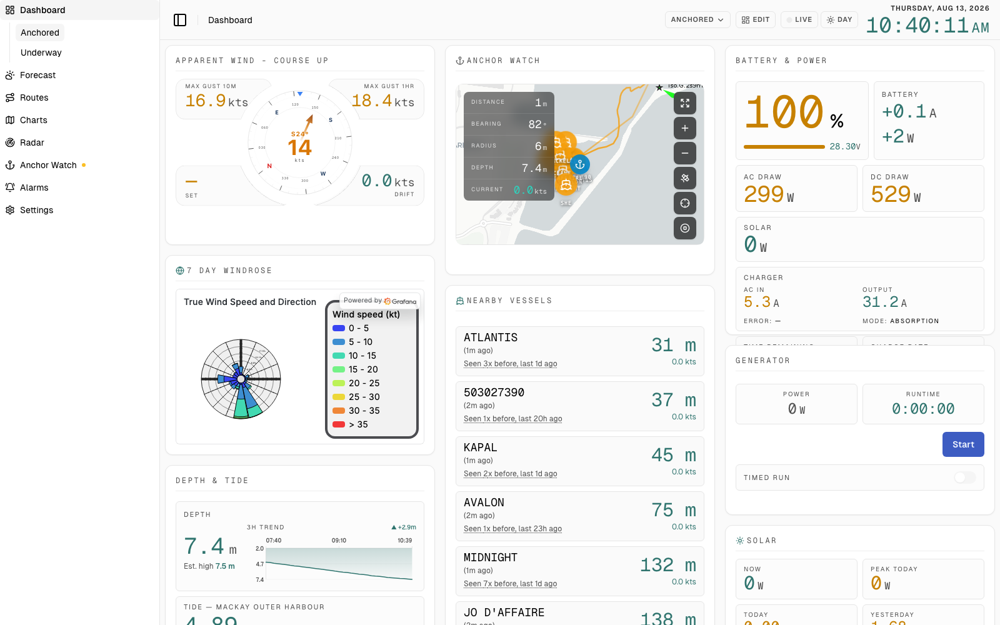

# Helmcentral

A boat dashboard for [SignalK](https://signalk.org/). It puts anchor watch,
tides, weather, routes, tanks and electrical monitoring on one screen at the
helm — and when something goes wrong, it tells you, on your phone, off the
boat.

It is one binary. The web UI is embedded in it, there is no database server to
run and no runtime dependencies. Everything it needs is free or self-hostable:
no cloud subscription, no API keys to get started, no proprietary hardware. If
you already have a SignalK server, you are one command away.



- **One binary, no dependencies.** The React UI is compiled into the Go binary
  via `//go:embed`. Linux (x86-64, arm64, armv7 — covers every Raspberry Pi),
  macOS and Windows.
- **Alarms on any SignalK path.** Battery voltage, tank level, depth, bilge,
  engine temperature, wind — no code changes, because rules name paths from the
  live delta stream. Five SignalK severities, mandatory dwell and hysteresis so
  a value hovering at a threshold can't produce an alarm storm.
- **Alarms from the rest of the bus, for free.** Helmcentral is a consumer *and*
  a producer on SignalK's `notifications.*` tree, so alarms raised by a Victron
  GX, an N2K device or another plugin appear in its list with no per-source
  integration — and its own rules reach your MFD the same way.
- **Delivery that survives a bad connection.** ntfy, SMTP, webhook, or SignalK
  itself. A failed send is queued and retried with backoff from 30s to 30m for
  up to 24h, every attempt logged.
- **It knows when it has gone blind.** A watchdog raises when the SignalK
  stream dies (a frozen dashboard otherwise looks like a calm boat), and a
  periodic heartbeat off the boat makes its *absence* the alarm.
- **Your layout, not ours.** 16 built-in widgets plus embeddable tiles, across
  named pages you can switch between. Drag, resize, hide, and add from a picker
  — persisted server-side, no redeploy.
- **Keyless forecasts.** Open-Meteo and Open-Meteo Marine are the defaults, so
  a fresh install has working weather, wind and swell with zero configuration.
- **Sandboxed provider plugins.** Add a region's government tide API by
  dropping a WASM file in a directory. No fork, no Go, no rebuild. Plugins get
  no filesystem, no process access, and no network beyond an explicit
  per-plugin allowlist.

## Install

```sh
curl -fsSL https://raw.githubusercontent.com/gterrill/helmcentral/main/install.sh | sh
```

Then open `http://<this-machine>:8080/`. On first run Helmcentral searches your
network for a SignalK server and offers what it finds — there is nothing to
edit by hand.

[Other ways to install](#other-ways-to-install), including Docker, are below.

> [!WARNING]
> **Helmcentral has no authentication**, its API can control connected
> equipment (generator start/stop, CZone switching), and it sends
> `Access-Control-Allow-Origin: *`. Run it on a trusted boat LAN only — never
> port-forward it to the internet. For remote access, put it behind a VPN or an
> authenticating reverse proxy.

---

## Contents

- [Requirements](#requirements)
- [Other ways to install](#other-ways-to-install)
- [Configuration](#configuration)
- [What's on the dashboard](#whats-on-the-dashboard)
- [Alarms](#alarms)
- [Provider plugins](#provider-plugins)
- [Development](#development)
- [Architecture](#architecture)
- [Roadmap](#roadmap)
- [Contributing](#contributing)

## Requirements

- **Linux, macOS or Windows.** Linux gets a systemd service; armv7 and arm64
  builds cover every Raspberry Pi.
- **A SignalK server** reachable on your network, with these plugins:

  | Plugin | Provides |
  | --- | --- |
  | [`signalk-derived-data`](https://github.com/SignalK/signalk-derived-data) | True wind and other derived navigation data |
  | [`tracks`](https://github.com/SignalK/tracks) | Vessel trails and historical path data |
  | [`signalk-venus-plugin`](https://github.com/sbender9/signalk-venus-plugin) | Generator and advanced electrical state (Victron GX devices) |
  | [`signalk-to-influxdb-v2`](https://github.com/tkurki/signalk-to-influxdb-v2) | Optional — only for InfluxDB-backed history |

That's it. Telemetry history is in-memory by default; InfluxDB is an opt-in
enhancement for longer retention, not a requirement.

## Other ways to install

### Install script (recommended)

```sh
curl -fsSL https://raw.githubusercontent.com/gterrill/helmcentral/main/install.sh | sh
```

Detects your platform, verifies the download against the published checksums,
installs to `/usr/local/bin`, creates `/var/lib/helmcentral` for state,
installs the reference plugin bundle, and enables a systemd service on Linux.
**Re-run it any time to upgrade** — your settings and data are left alone.

Pin a version or change locations with `HELMCENTRAL_VERSION`,
`HELMCENTRAL_PREFIX`, `HELMCENTRAL_STATE_DIR`.

Useful afterwards:

```sh
systemctl status helmcentral
journalctl -u helmcentral -f
```

On macOS the script installs the binary and prints how to run it (no launchd
service). On Windows, download the `.zip` from the
[releases page](https://github.com/gterrill/helmcentral/releases).

### Manual binary download

Grab the archive for your platform from the
[releases page](https://github.com/gterrill/helmcentral/releases), then:

```sh
tar -xzf helmcentral_<version>_linux_arm64.tar.gz
sudo install -m0755 helmcentral /usr/local/bin/helmcentral

# State must live somewhere explicit, or it lands in the working directory.
sudo mkdir -p /var/lib/helmcentral
HELMCENTRAL_STATE_DIR=/var/lib/helmcentral \
  SETTINGS_FILE=/var/lib/helmcentral/settings.yaml \
  helmcentral
```

The archive also contains `packaging/helmcentral.service` if you want the
systemd unit, and `settings.example.yaml` as a starting config.

### Docker

The image is multi-arch (amd64, arm64, armv7), so it runs on a Raspberry Pi.
Grab `docker-compose.yml` from this repo, then, from the directory containing
it:

```sh
# 1. Add the reference plugins first — compose bind-mounts ./plugins, and
#    without them there are no tide, weather, wave or warning providers.
#    They are deliberately not baked into the image, so you can add or update
#    one without repulling.
mkdir -p plugins && curl -fsSL \
  https://github.com/gterrill/helmcentral/releases/latest/download/helmcentral-plugins-<version>.tar.gz \
  | tar -xz -C plugins

# 2. Start it.
docker compose pull
docker compose up -d --force-recreate
```

Dashboard and API: <http://localhost:9091> (change the left-hand side of the
port mapping to serve it elsewhere). State lands in `./backend-data`, created
on first run — nothing needs to exist beforehand.

Stop with `docker compose down`.

## Configuration

Helmcentral needs no configuration file to start, and **secrets are never set
in files or environment variables**. Start with none configured, then paste
SignalK credentials, the InfluxDB token, and GeoNames/WeatherKit keys into
Settings → Secrets in the running app, where they are encrypted at rest with
AES-256-GCM ([ADR 0023](docs/adr/0023-encrypted-secrets-store.md)).

> Back up `data/secrets.key`. Lose it and every stored credential is
> unrecoverable.

- **Full operator reference:** [docs/configuration.md](docs/configuration.md) —
  every environment variable, state path, and startup behaviour.
- **Upgrading across a breaking release:**
  [docs/upgrading.md](docs/upgrading.md).

## What's on the dashboard

Sixteen built-in widgets: Vessel, Apparent Wind, Depth & Tide, Position,
Today & Now, Anchor Watch, Rode & Scope, Tanks, Route, Nearby Vessels,
Battery & Power, Solar, Alternator, Generator, Switches, and Hot Water. Plus
embed tiles, which put any URL (a Grafana panel, a camera feed) in the grid —
the windrose in the screenshot above is one.

Arrange them yourself: toggle layout mode in the header, then drag, resize, or
remove widgets and add them back from a picker. Layouts are named **pages** you
switch between — "Anchored" and "Underway" want different screens. Everything
is persisted server-side and restored next session
([ADR 0012](docs/adr/0012-configurable-bento-dashboard.md),
[ADR 0013](docs/adr/0013-multi-page-dashboard.md)).

Beyond the grid:

- **Anchor watch** with server-owned trail sampling for your vessel and nearby
  AIS targets — the server samples and clients consume deltas, so the trail
  keeps building whether or not a browser tab is open. (The drag klaxon itself
  is still browser-tab-only; migrating it onto the alarm engine is on the
  [roadmap](#roadmap).)
  ([ADR 0001](docs/adr/0001-server-owned-trail-sampling.md),
  [ADR 0002](docs/adr/0002-separate-motoring-and-anchor-trails.md)).
- **Route planning** — multi-leg waypoint sequences with per-leg distance,
  bearing and ETA. A saved route can be *activated*, pushing it to SignalK as
  the vessel's active route so autopilots and MFDs can follow it. This is
  manual waypoint planning only: no hazard avoidance, no weather routing, no
  chart licensing dependency, and Helmcentral itself does no live navigation
  ([ADR 0006](docs/adr/0006-manual-route-planning.md),
  [ADR 0007](docs/adr/0007-signalk-route-activation.md)).
- **Satellite charts** — upload your own MBTiles and Helmcentral serves them.
  It never fetches or bulk-caches tiles from a live provider, so it takes on no
  licensing exposure
  ([ADR 0011](docs/adr/0011-mbtiles-satellite-chart-upload.md)).
- **Weather radar** via an embedded Windy map, centred on the vessel.
- **Max wind gust** over a window you pick per readout — 10m, 30m, 1h or 24h
  ([ADR 0030](docs/adr/0030-selectable-max-gust-windows.md)).

The layout is responsive down to a phone, with three structurally different
layouts across the range
([ADR 0032](docs/adr/0032-responsive-dashboard-below-grid-breakpoint.md)).

## Alarms

Rules can name **any path the SignalK server publishes**, because ingestion is
a delta-stream subscription rather than a hardcoded path list
([ADR 0037](docs/adr/0037-signalk-delta-stream-ingestion.md)). No code change
is needed to alarm on something new.

Helmcentral speaks SignalK's own notification vocabulary — severities are
`normal | alert | warn | alarm | emergency` verbatim — which is what makes it
work in both directions: alarms raised anywhere else on the bus show up here
untranslated, and its own rule hits are written back to `notifications.*` where
a buzzer plugin or an MFD can react without knowing Helmcentral exists.

Three things it does deliberately:

- **Dwell and hysteresis are mandatory, not polish.** A rule must hold for its
  dwell before firing, and the value must travel back past a deadband before
  clearing. Alarm storms are the single most common reason people switch marine
  alarms off — and an alarm system that has been switched off is worth less
  than none, because it is still trusted.
- **Absence is never a value.** A missing path does not satisfy a threshold, so
  a freshly booted boat doesn't fire every rule. Symmetrically, a live alarm
  does not clear when its path goes stale — otherwise a dying sensor silences
  its own alarm.
- **Failures are queued, not dropped.** Retried from 30s to 30m for 24h, then
  discarded, because delivering a day-old alarm as if it were current is its
  own kind of wrong. The heartbeat is the exception: it is never queued, since
  a burst of stale "still alive" messages is worse than useless.

Four transports, none requiring a paid subscription: **ntfy** (self-hostable,
or the free public server, no account), **SMTP**, **webhook**, and **SignalK
`notifications.*`**, which needs no internet at all. `POST
/api/alarm-transports/test` probes every enabled transport — discovering at 3am
that the ntfy topic was mistyped is the failure that justifies one button.

Full design and its trade-offs: [ADR 0038](docs/adr/0038-alarms.md).

## Provider plugins

Tides, weather, waves and forecast warnings are **not built in**. Each is a
sandboxed WASM plugin loaded from disk, so adding another region's government
API means dropping a `.wasm` file into a directory — no fork, no Go, no
rebuild, and the new provider appears in the existing Settings dropdown on
restart.

| Category | Bundled reference plugins |
| --- | --- |
| Tides | `bom` (Australia), `noaa` (US) |
| Weather | `open-meteo` (worldwide, keyless — default), `weatherkit` (Apple, needs keys) |
| Waves | `open-meteo-marine` (default) |
| Forecast warnings | `bom` (Australia, default), `nws` (US) |

Plugins run under [Extism](https://extism.org/)/[wazero](https://wazero.io/):
no filesystem, no process access, and network default-deny — a plugin reaches
only the hosts named in its `allowed_hosts.json` sidecar. The host owns all
derived data (units, interpolation, caching, timezone bucketing), so a plugin
only ever returns raw provider numbers. Write one in any language with an
Extism PDK.

**Tides are the one thing with no default.** Tide data is tied to physical
station networks rather than a global model, so there is no keyless worldwide
API to hardcode and no fallback provider. Pick `ui.tide_provider` in Settings
to match your region; until you do, `/api/tide-today` returns an error naming
what's missing rather than guessing.

Contracts, the sandbox model, and how to build a plugin:
**[docs/plugins.md](docs/plugins.md)**.

## Development

Requires **Go 1.22** and **Node.js 20+**. The Go toolchain is deliberately
pinned at 1.22 — several dependencies are held back to match, so don't let
`go get -u` bump the `go` directive
([ADR 0037](docs/adr/0037-signalk-delta-stream-ingestion.md)). CI and release
builds use Node 24; the dev containers run Node 20.

In two terminals, from the repo root:

```sh
cd backend && go run .                      # API on :8080
```

```sh
cd frontend && npm install && npm run dev   # Vite dev server on :5173
```

Open <http://localhost:5173>.

The Vite dev server proxies `/api` to `localhost:8080`, so the frontend always
talks to the backend on the same origin — exactly as in a release build, where
the SPA is embedded in the binary.

### Tests

```sh
cd backend && go test -short ./...   # -short skips live BOM FTP round-trips
cd frontend && npm test && npm run lint
```

### Docker workflows

```sh
make dev     # backend-dev (air hot-reload) + frontend-dev (Vite) — :8080 / :5173
make logs    # tail both
make down    # stop

make e2e-up  # isolated stack on :5174 for anything that mutates state
```

Use the E2E stack for any script that clicks Save — the dev stack bind-mounts
your live `settings.yaml` and can take a real dashboard offline
([ADR 0026](docs/adr/0026-e2e-stack-isolation.md)).

A production-like build is
`docker compose -f docker-compose.dev.yml --profile prod up --build -d backend frontend`.

### Release builds

```sh
goreleaser build --snapshot --clean   # cross-compiles every published target
```

Build hooks build the frontend and stage it into `backend/dist` for the
`//go:embed`, so a snapshot binary is the real thing. Tagging `vX.Y.Z` and
pushing runs [.github/workflows/release.yml](.github/workflows/release.yml),
which publishes the archives, the WASM plugin bundle, and the multi-arch image.

## Architecture

```
helmcentral/
├── backend/          # Go REST API; embeds the built frontend
├── frontend/         # React + TypeScript + Vite dashboard
├── plugins/          # WASM providers, by category
├── packaging/        # systemd unit, plugin build script
├── docs/adr/         # Architecture decision records
├── install.sh        # One-line installer
└── docker-compose.yml
```

- **Backend** — Go with the Echo framework. Serves the API and the SPA from one
  port. Endpoint reference: [backend/README.md](backend/README.md).
- **Frontend** — React + TypeScript, built with Vite, designed for a helm
  touchscreen.
- **Ingestion** — one WebSocket subscription to SignalK's delta stream,
  reassembled into a snapshot tree. It is the *only* ingestion path: there is
  no REST fallback and no toggle, because a fallback would mask exactly the
  upstream failures the watchdog exists to catch. REST survives only for
  probing during discovery and connection tests
  ([ADR 0037](docs/adr/0037-signalk-delta-stream-ingestion.md)).
- **Storage** — SQLite for secrets, alarm history and tile caches; JSON files
  for routes and dashboard pages. Telemetry history is an in-memory ring
  buffer by default, with InfluxDB optional for longer retention
  ([ADR 0020](docs/adr/0020-in-memory-telemetry-history-optional-influxdb.md)).
- **Startup is fail-fast.** If the secrets store or a plugin-override database
  can't be opened, the process exits rather than running degraded.

Durable design decisions live in [docs/adr/](docs/adr/) — 38 of them, covering
why each non-obvious trade-off went the way it did.

## Roadmap

- **Authentication and authorization.** Helmcentral is currently
  unauthenticated and assumes a trusted LAN. This is the largest known gap; see
  the warning under [Install](#install).
- **Migrate the anchor drag klaxon onto the alarm engine.** It is still
  browser-tab-only Web Audio, so closing the tab silences it
  ([ADR 0038](docs/adr/0038-alarms.md)).
- **mDNS-based SignalK discovery**, now viable for native installs — the
  container networking that ruled it out no longer applies
  ([ADR 0029](docs/adr/0029-signalk-discovery.md)).

## Contributing

Issues and pull requests are welcome. CI runs `go vet`, the Go and frontend
test suites, lint, and a full cross-platform release build on every PR — run
those locally first (see [Development](#development)).

If a change turns on a non-obvious trade-off, add an ADR alongside it in
[docs/adr/](docs/adr/).

## License

[MIT](LICENSE)
